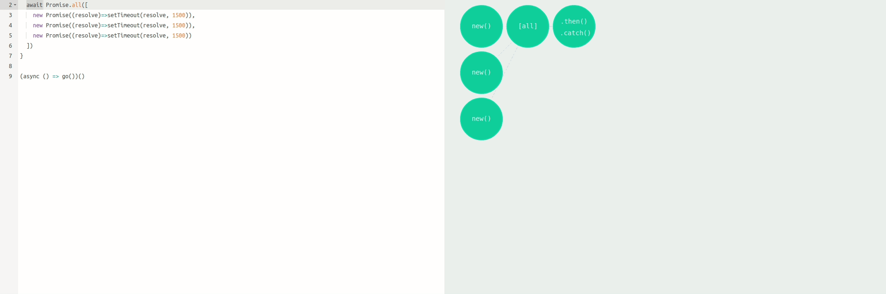
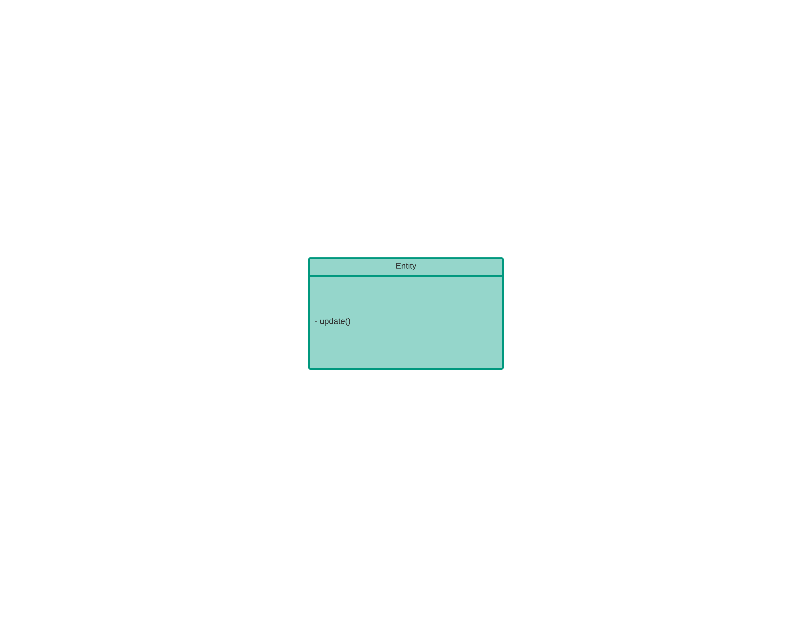
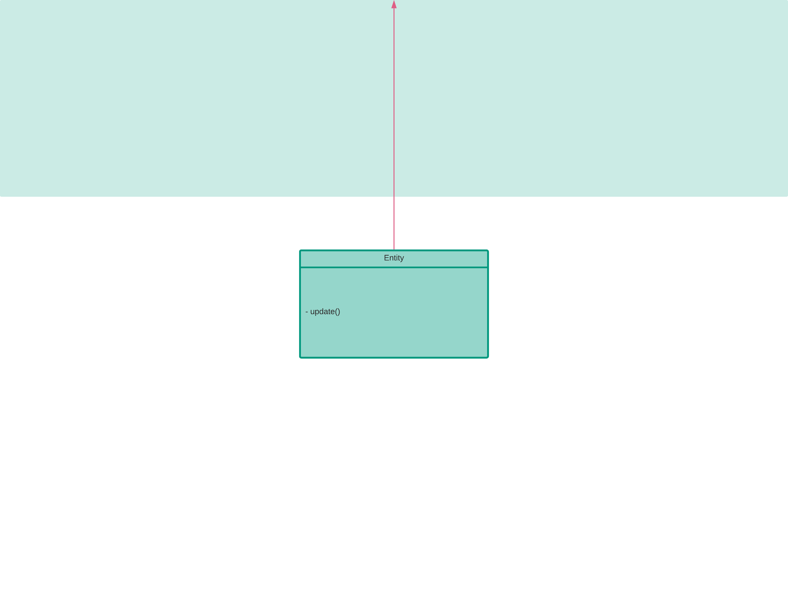
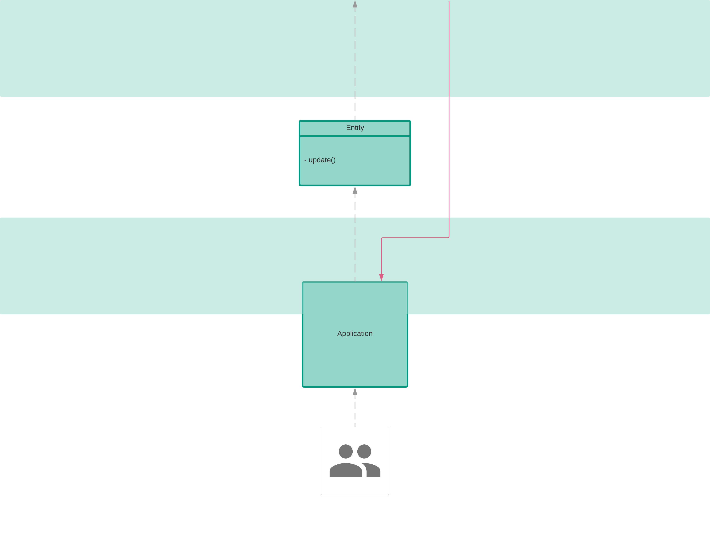
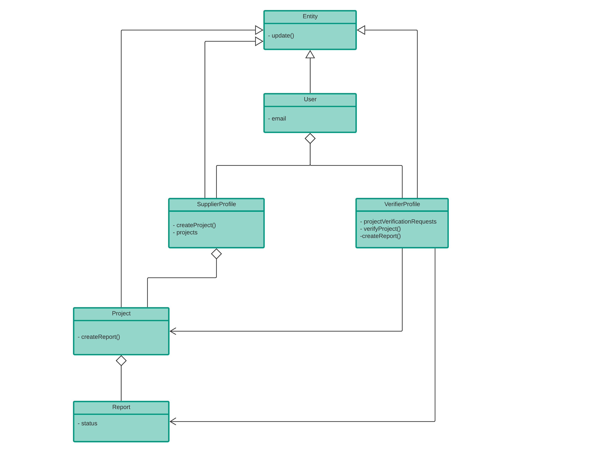
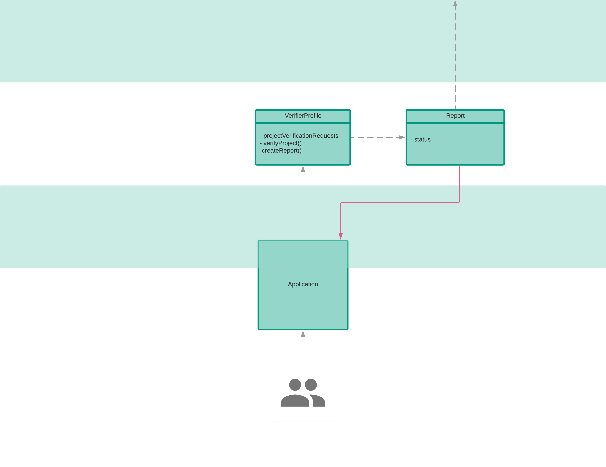
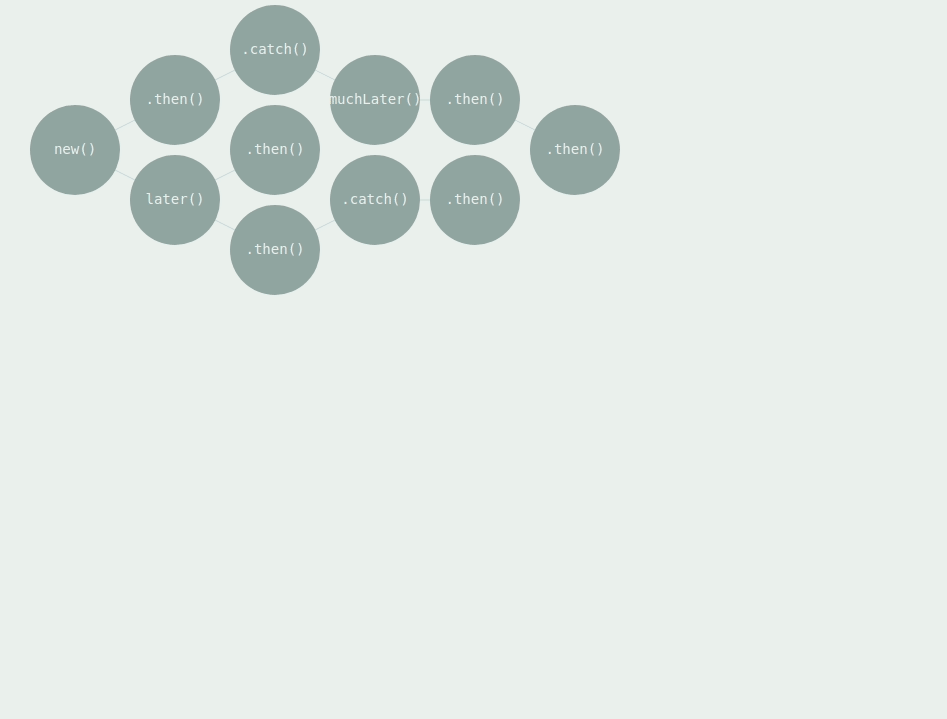
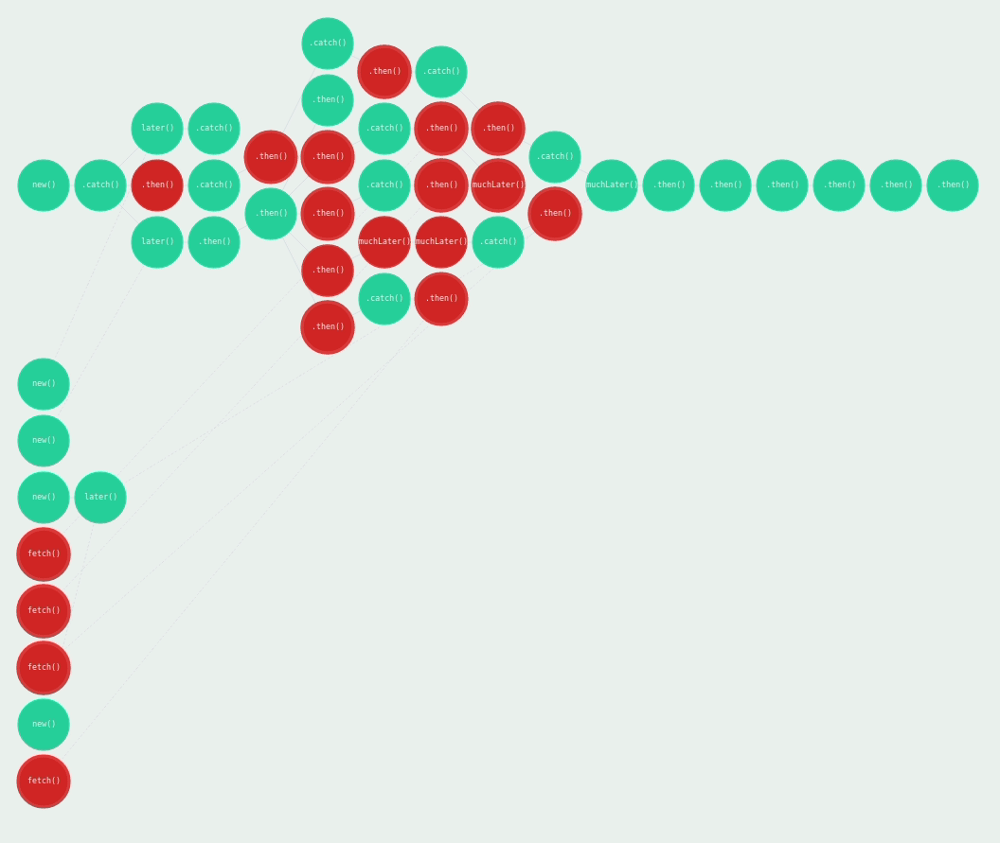

export { default as theme } from './theme';

import { Notes, Image } from 'mdx-deck';

# Fantastic Asynchrony and How to Find It

---

So, you've got code like this:


and you want code like this:


---

# The problem

Creating asynchrony is easy.

Coordinating asynchrony is hard.

Distributing asynchrony is harder.

<Notes>

- The best part about about asynchronous code is that it's asynchronous.

- The worst part about asynchronous code is that it's asynchronous.

--

- It is often desired to trigger additional jobs based on an initial operation.
  Often, those jobs require a chain of async/await calls to execute sequentially
  in order to look up relevant properties for use in the newly spawned jobs.

- Unfortunately, due to the way JS's event loop works, consuming async/await to
  look up the data for those additional jobs would cause a delay in the initial
  job's finalization.

- As such, a pattern is needed to spawn new tasks in entirely different contexts.

</Notes>

---

# Creating asynchrony is easy.

---

Creating asynchrony is easy


---

Coordinating asynchrony is easy


---

Parallelizing asynchrony is easy



---

But what about in a real-world use case?

---

# _Let there be light_

---

<Image size="50%" src="images/0.png" />

<Notes>

When you start to build something, you start at the foundation.

Consider a simple use case.

You have a single data entity which has a function to update its data.

</Notes>

---

import { SplitRight } from 'mdx-deck/layouts';

export default SplitRight;

<div style={{width:"90%"}}>

```typescript
// Entity.ts

interface EntityObject {
  [name: string]: any;
}

class Entity<T extends EntityObject> {
  public static readonly kind: string;
  protected readonly data: T;

  constructor(data: T, req?: IViewerContext) {
    this.data = data;
  }

  async update<T extends object, E extends Entity<T>>(
    newData: T,
    req?: IViewerContext
  ) {
    const entityData: object = {
      ...(<object>this.data),
      ...(<object>newData),
      dateLastUpdated: new Date(Date.now()),
    };
    const [response] = await GCloudDB().update(entityData);
    return <E>new (<typeof Entity>this.constructor)(entityData, req);
  }
}
```

</div>

<div style={{ width: '90%', margin: 'auto' }}>
  
</div>

<Notes>
The code to interact with that data entity might looks something like this.

It contains one function of note: update()

That function is asynchronous so that we can await for that update to finish.

When the update finishes, we return the entity with the updated data.

</Notes>

---

export default SplitRight;

<div style={{width:"90%",  margin: "auto"}}>

```typescript
const entity = new Entity({}); // create the entity

entity.update({ data: 'some data' })); // trigger an update; don't await the result
```

</div>

<div style={{ width: '90%', margin: 'auto' }}>
  
</div>

<Notes>

Consuming that function looks something like this.

We create a reference to an entity, and then immediately invoke its logic.

That logic fires, and begins to perform something elsewhere

</Notes>

---

<Image size="50%" src="images/3.png" />

<Notes>

Real applications aren't so simple.

We have users on one end who are interested in waiting for the result.

</Notes>

---

<Image size="50%" src="images/4.png" />

<Notes>

And that result is expected to be presented when finished.

</Notes>

---

export default SplitRight;

<div style={{width:"90%"}}>

```js
// updater.js

const updateEntity = async () => {
  const entity = new Entity({}); // create the entity
  // trigger an update to the entity
  const updatedEntity = await entity.update({ data: 'some data' });
  return updatedEntity;
};

export default updateEntity;
```

```jsx

// Application.js

import React from 'react';

import updateEntity from './updater'

export default () => (
  <div>
    <button
      onClick={ async () => {
        // waits for entity to finish updating
        const updatedEntity = await updateEntity();
        alert(updatedEntity); // then alert the entity update in the UI
      }
    />
  </div>
)

```

</div>

<div style={{ width: '90%', margin: 'auto' }}>
  
</div>

<Notes>

That code might look like this.

We have an async function that loads the entity.

Then we trigger an update

We await for the update to finish so we can grab the updated entity reference.

We return that reference

--

In the UI's code, we have a button to trigger the update, and alert to display the updated entity.

</Notes>

---

### But it's never quite that simple

<Notes>

# If only.

Applications quickly grow from a foundational concept into complex models that contain relationships, connections, modules, and more

</Notes>

---

<Image size="50%" src="images/uml.png" />

<Notes>

Let's examine the relationship of a more realistic entity model, one very similar to one I'm currently working with.

Note that some of these data entities are linked to others in a relatively traditional relational DB way.

As such, the thing to point out is that when we want to interact with some subset of an entity, we often start with the ID of one, and use that to traverse entities until we reach the subset we want to interact with.

This is typically unavoidable as it would be unrealistic to always have the ID of the entity we need. This is because:

- real user interactions are highly unpredictable.
- some entities may not exist until after an intial action creates it
- the more entities you keep in context, the higher the resource cost

</Notes>

---

export default SplitRight;

<div style={{width:"90%"}}>

```typescript
// Entity.ts

class Entity<T extends EntityObject> {
  // ...

  get id() {
    return this.key ? this.key.id : null;
  }
}

interface EntLoaderConstructor<D extends object, T extends Entity<D>> {
  new (): EntLoader<D, T>;
}

abstract class EntLoader<D extends object, T extends Entity<D>> {
  abstract async fromId(
    id: string | number | PathElement[],
    req: IViewerContext
  ): Promise<T>;
}

abstract class EntDataStoreBackedLoader<
  D extends object,
  T extends Entity<D>
> extends EntLoader<D, T> {
  kind: string;
  cls: EntConstructor<D, T>;

  async fromId(id: string | number | PathElement[], req: IViewerContext) {
    return this.fromKey(GCloudDB().key(id), req);
  }
}
```

</div>

<div style={{ width: '90%', margin: 'auto' }}>
  
</div>

<Notes>

We might write code that looks like this to model the interactions between those entities

We continue building on the Entity foundation, and extend it to create other entities with different data, yet share the same asynchronous update foundation.

</Notes>

---

<Image size="50%" src="images/5.png" />

---

export default SplitRight;

<div style={{width:"80%"}}>

```typescript
// EntReport

export class EntReportLoader extends EntDataStoreBackedLoader<
  EntReportData,
  EntReport
> {
  kind = 'Report';
  cls = EntReport;
}
```

```typescript

// EntVerifierProfile

export class EntVerifierProfileLoader extends EntDataStoreBackedLoader<
  EntVerifierProfileData,
  EntVerifierProfile
> {
  kind = 'VerifierProfile';
  cls = EntVerifierProfile;
}

export default class EntVerifierProfile extends Entity<
  EntVerifierProfileData
> {
  static kind = 'VerifierProfile';
  async function projectVerificationRequests(reportId) {
    const report = await new ReportLoader().fromId(reportId);
    return report;
  }
}

```

```js
// getReport.js

const getReport = async (verifierId, reportId) => {
  const verifier = await new EntVerifierProfileLoader().fromId(verifierId);
  const [report] = await verifier.projectVerificationRequests(reportId);
  return report;
};
```

</div>

<div style={{ width: '90%', margin: 'auto' }}>
  
</div>

---

#### Asynchronous calls which depend on the previous call to finish start to quickly add up

```js
const getReport = async (verifierId, reportId) => {
  const verifier = await new EntVerifierProfileLoader().fromId(verifierId);
  const [report] = await verifier.projectVerificationRequests(reportId);
  return report;
};
```

---

Consider this more realistic data relationship interaction

---

<Image size="50%" src="images/7.png" />

---

<Image size="50%" src="images/8.png" />

---

At what point is using a traditional async pattern not enough?

<Notes>
  Where do we draw the line and say, "We need a multiple threads for this", or
  "We need an additional microservice"
</Notes>

---

Is it here?



---

How about here?



---

~~Creating asynchrony is easy~~

Coordinating asynchrony is hard.

---

### Writing asynchronous code is easy, and it's clean.

##### _Until it isn't._

---

<Image size="50%" src="images/micro0.png" />

---

<Image size="50%" src="images/micro1.png" />

---

It may take time to set up a centralized controller.

##### But ultimately, you still have full control.

---

~~Creating asynchrony is easy~~

~~Coordinating asynchrony is hard.~~

Distributing asynchrony is harder.

---

<Image size="50%" src="images/micro2.png" />

---

<Image size="50%" src="images/micro3.png" />

---

<Image size="50%" src="images/micro4.png" />

---

<Image size="50%" src="images/micro5.png" />

---

At the Macro level, async/await control helps a lot.

##### _But not without a pattern for concurrency_

---

<Image size="50%" src="images/external0.png" />

---

<Image size="50%" src="images/external1.png" />

---

<Image size="50%" src="images/external2.png" />

---

<Image size="50%" src="images/external3.png" />

---

<Image size="50%" src="images/external4.png" />

---

<Image size="50%" src="images/external5.png" />

---

Pattern considerations

---

How can we create patterns for concurrency and asynchronous execution at the microservice level?

---

How can we handle distribution of tasks amongst resources?

---

How do we create consistent error handling?

---

How do we create a completely non-blocking workflow?

---

How do we persist context across distributed workflows whilst also preventing duplicate work?

<Notes>
  Passing messages is often not enough if you want to maintain relationships or
  other context variables containing things like modules or asynchronus data
  fetch results
</Notes>

---

## An Explortation of Asynchronous Patterns

##### Note: condensed code/notes can be found here: https://github.com/jaycenhorton/async-explore

---

#### Async/Await

```js
// async.js
const asyncFunc = async () => {
  return new Promise(resolve => {
    setTimeout(() => {
      console.log('5 second operation finishing in asyncFunc');
      resolve();
    }, 5000);
  });
};
const exec = async time => {
  await asyncFunc();
  setTimeout(() => {
    console.log('Finished 5 second operation in exec');
    const end = process.hrtime.bigint();
    console.log('Benchmark took %d nanoseconds', end - time);
  }, 5000);
};
const time = process.hrtime.bigint();

(async () => exec(time))();
```

```
node --experimental-worker async
Finished 5 second operation in asyncFunc
Finished 5 second operation in exec
Benchmark took 10012905082 nanoseconds
```

<Notes>
  This demonstrates that the second `setTimeout` will not begin to process until
  the first awaited promise is finished

But often we don't want the user to wait on the results of the first to finish. How can we create an optimistic return value that gets updated only if the return value differs?

</Notes>

---

"Promise.all"


---

"Promise.all" is a godsend for executing tasks in parallel

<Notes>

But it isn't usefultwhen you need to chain an indeterminate number
of additional async calls (with various lengths in run time) that are dependent on previous ones finishing.

Often we need to spawn this in a different context. So long as the user isn't waiting on the results of one of those, that's ok.

</Notes>

---

#### JS Proxy patterns

---

#### Async/await in a transparent proxy

```js
function traceMethodCalls(obj) {
  const asyncFuncInProxy = async () =>
    new Promise(resolve => {
      setTimeout(() => {
        console.log('Finished 5 second operation asyncFuncInProxy');
        resolve();
      }, 5000);
    });

  const handler = {
    get(target, propKey, receiver) {
      const targetValue = target[propKey];
      return async function asyncProxy(...args) {
        await asyncFuncInProxy();
        return targetValue.apply(this, args);
      };
    },
  };
  return new Proxy(obj, handler);
}

const obj = {
  async asyncFunc(time) {
    setTimeout(() => {
      console.log('Finished 5 second operation in asyncFunc');
      const end = process.hrtime.bigint();
      console.log(`Benchmark took %d nanoseconds`, end - time);
    }, 5000);
  },
};

const tracedObj = traceMethodCalls(obj);
const time = process.hrtime.bigint();
(async () => tracedObj.asyncFunc(time))();
```

```
node --experimental-worker asyncProxy
Finished 5 second operation asyncFuncInProxy
Finished 5 second operation in asyncFunc
Benchmark took 10008815778 nanoseconds
```

<Notes>
  This demonstrates that the second `setTimeout` will not begin to process until
  the first awaited promise is finished even though the first `setTimeout` only
  exists in the context of the proxy.
</Notes>

---

#### Multithreaded async/await in a proxy

```js
function traceMethodCalls(obj) {
  const handler = {
    get(target, propKey, receiver) {
      const targetValue = target[propKey];
      return async function asyncProxy(...args) {
        (async () => {
          const { job, start, stop } = require('microjob');
          try {
            // start the worker pool
            await start();
            // this function will be executed in another thread
            const resolvedJob = await job(
              async data =>
                new Promise(resolve => {
                  setTimeout(() => {
                    console.log('Finished 5 second operation asyncFuncInProxy');
                    const end = process.hrtime.bigint();
                    resolve(`Benchmark took %d nanoseconds`, end - data.time);
                  }, 5000);
                }),
              { data: { time: args[0] } }
            );
            console.log(resolvedJob);
          } catch (err) {
            console.error(err);
          } finally {
            // shutdown worker pool
            await stop();
          }
        })();
        return targetValue.apply(this, args);
      };
    },
  };
  return new Proxy(obj, handler);
}
```

---

#### Multithreaded async/await in a proxy cont.

```js
const obj = {
  async asyncFunc(time) {
    return new Promise(resolve => {
      setTimeout(() => {
        console.log('Finished 5 second operation in asyncFunc');
        resolve();
      }, 5000);
    });
  },
};

const tracedObj = traceMethodCalls(obj);
const time = process.hrtime.bigint();
(async () => tracedObj.asyncFunc(time))();
```

```
node --experimental-worker asyncProxyThread
Finished 5 second operation in asyncFunc
Finished 5 second operation asyncFuncInProxy
Benchmark took 5108165406 nanoseconds
```

---

#### Proxy publisher

<Notes>

Using pub/sub pattern from within a transparent proxy is an interesting idea. It would mean a non-blocking workflow and a standardized pattern for message distribution.

BUT

How do we persist context? How do we avoid duplicate work?

</Notes>

---

# The end
